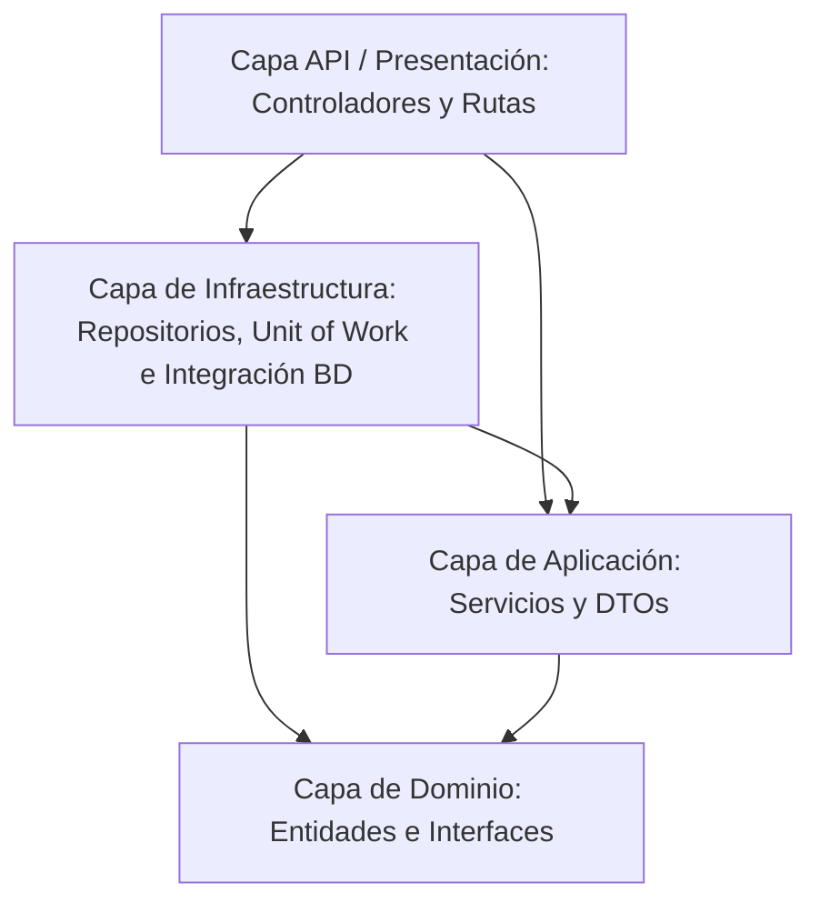

# Guía y Explicación de la Arquitectura del Proyecto (Go + GORM + Gin)

Este documento ha sido diseñado para servir de guía explicativa a desarrolladores, compañeros de equipo o evaluadores. Su objetivo es desglosar la estructura del proyecto **companies-api**, detallando cómo se aplica la **Onion Architecture** (Arquitectura Cebolla) y cómo se implementan los patrones **Repository** y **Unit of Work** en Go.

---

## 1. Introducción y Stack Tecnológico

El proyecto es una **API REST** funcional desarrollada en **Go (Golang)** encargada de gestionar **Compañías** y sus **Empleados**. 

### El Stack de Tecnologías:
*   **Go (Golang):** Elegido por su alto rendimiento, concurrencia nativa eficiente y compilación directa a binario único.
*   **Gin:** Un framework web HTTP ligero y rápido para enrutamiento, middlewares y manejo de peticiones HTTP en Go.
*   **GORM:** El ORM (Object-Relational Mapper) líder en Go. Facilita la persistencia de datos de manera limpia, gestionando relaciones y transacciones seguras.
*   **PostgreSQL (Supabase):** Base de datos relacional para almacenar las entidades con integridad referencial estricta.
*   **Zap (Uber):** Librería de logging de alto rendimiento para el registro de eventos en consola.

---

## 2. Onion Architecture (Arquitectura de Cebolla)

La arquitectura de este proyecto se basa en la **Onion Architecture**. El principio fundamental de este diseño es la **Regla de Dependencia**:
> **Las capas internas no conocen nada sobre las capas externas.** Las dependencias fluyen siempre hacia el centro (hacia el Dominio).



### ¿Por qué Onion Architecture?
1.  **Independencia de Frameworks/ORMs:** Si el día de mañana se cambia Gin por Fiber, o GORM por SQL puro, la lógica de negocio (Servicios) y el Dominio no sufren ningún cambio.
2.  **Testabilidad:** Dado que el dominio y los servicios operan a nivel de interfaces abstractas, es extremadamente sencillo simular (*mockear*) la base de datos para realizar pruebas unitarias rápidas.
3.  **Mantenibilidad:** Cada archivo tiene una única responsabilidad y la separación de capas evita el acoplamiento cruzado de código.

---

## 3. Estructura de Directorios y Archivos (Paso a Paso)

A continuación se detalla qué hace cada carpeta y archivo dentro del proyecto:

```
/companies-api
│
├── /domain                    # Capa del Dominio (Núcleo)
│   ├── /entities              # Modelos de negocio o Entidades
│   │   ├── compania.go        # Definición de la entidad Compañía y su relación 1:N
│   │   └── empleado.go        # Definición de la entidad Empleado y su Foreign Key
│   └── /interfaces            # Contratos abstractos de Repositorios y UoW
│       ├── compania_repository.go
│       ├── empleado_repository.go
│       └── unit_of_work.go
│
├── /application               # Capa de Aplicación (Casos de uso)
│   ├── /dtos                  # Data Transfer Objects (Request/Response)
│   │   ├── compania_dto.go    # Validaciones y estructuras para crear/actualizar Compañías
│   │   └── empleado_dto.go    # Validaciones y estructuras para crear/actualizar Empleados
│   └── /services              # Lógica de negocio orquestada
│       ├── compania_service.go# Casos de uso de Compañía (incluye el flujo transaccional)
│       └── empleado_service.go# Casos de uso de Empleados
│
├── /infrastructure            # Capa de Infraestructura (Lógica técnica)
│   ├── /database              # Conexión, Migración y Carga Inicial (Seed)
│   │   ├── connection.go      # Inicializa GORM y ejecuta AutoMigrate
│   │   └── seed.go            # Inserta 3 compañías y 10 empleados si la BD está vacía
│   ├── /repositories          # Implementación concreta de los Repositorios usando GORM
│   │   ├── compania_repository_impl.go
│   │   └── empleado_repository_impl.go
│   └── /unit_of_work          # Implementación de la transacción y sesión activa
│       └── unit_of_work_impl.go
│
├── /api                       # Capa de Presentación (Entrada de peticiones)
│   ├── /controllers           # Handlers HTTP encargados de parsear JSON y responder
│   │   ├── compania_controller.go
│   │   └── empleado_controller.go
│   ├── /middlewares           # Interceptores de peticiones (Logging, Error, CORS)
│   │   └── logger_middleware.go
│   └── /routes                # Configuración de endpoints e Inyección de Dependencias
│       └── routes.go
│
├── main.go                    # Punto de entrada de la app
├── swagger.yaml               # Especificación OpenAPI / Swagger
└── .env                       # Variables de configuración del entorno
```

---

## 4. Explicación de los Componentes Clave

### A. Capa de Dominio (Domain)
Es el núcleo central de la cebolla. Es puro Go, libre de frameworks o controladores HTTP.

*   **`domain/entities` (Entidades):** Representan el esquema lógico de los datos.
    *   *Ejemplo (`compania.go`):*
        ```go
        type Compania struct {
            ID            uint       `gorm:"primaryKey;autoIncrement"  json:"id"`
            Nombre        string     `gorm:"size:100;not null"         json:"nombre"`
            Direccion     string     `gorm:"size:200;not null"         json:"direccion"`
            Telefono      string     `gorm:"size:20;not null"          json:"telefono"`
            FechaCreacion time.Time  `gorm:"autoCreateTime"            json:"fecha_creacion"`
            Empleados     []Empleado `gorm:"foreignKey:CompaniaID"     json:"empleados,omitempty"`
        }
        ```
        Aquí, los struct tags `gorm:"..."` configuran cómo mapeará GORM las tablas en PostgreSQL, mientras que los tags `json:"..."` indican cómo se serializará y retornará al cliente REST.

*   **`domain/interfaces` (Interfaces):** Definen los contratos. El negocio no le pide datos a una base de datos específica; se los pide a "algo" que cumpla con la interfaz.
    *   *Ejemplo (`compania_repository.go`):*
        ```go
        type CompaniaRepository interface {
            GetAll() ([]entities.Compania, error)
            GetById(id uint) (*entities.Compania, error)
            Create(compania *entities.Compania) error
            // ...
        }
        ```

---

### B. Capa de Aplicación (Application)
Esta capa es responsable de ejecutar las reglas de negocio y orquestar las entidades de dominio y los contratos.

*   **`application/dtos` (DTOs):** Validan la entrada antes de enviarla a los servicios o transformarla a entidades reales. Previenen que datos maliciosos o mal estructurados afecten la lógica interna.
*   **`application/services` (Servicios):** Orquestan el flujo utilizando la interfaz de **Unit of Work** (UoW).

---

### C. Capa de Infraestructura (Infrastructure)
Aquí se implementan todos los detalles tecnológicos (GORM, PostgreSQL, Supabase).

*   **`infrastructure/repositories` (Repositorios):** Escriben las queries GORM reales para guardar o leer datos en la base de datos física.
*   **`infrastructure/unit_of_work` (Unit of Work):** Coordina los repositorios bajo una misma transacción transitoria.

---

### D. Capa de Entrada / API (Presentation)
Es el medio por el cual los clientes externos se comunican con el sistema.

*   **`api/controllers`:** Traducen solicitudes HTTP a estructuras del sistema (DTOs), delegan la acción a la capa de servicios, y retornan la respuesta con los códigos HTTP correspondientes (`200 OK`, `201 Created`, `400 Bad Request`, `500 Internal Error`).
*   **`api/routes/routes.go`:** Realiza la **Inyección de Dependencias Manual**. En Go, a diferencia de C# ASP.NET Core que tiene un contenedor nativo oculto, la inyección se hace de manera explícita conectando las capas de abajo hacia arriba:
    1.  Crea la conexión a la base de datos (`gorm.DB`).
    2.  Instancia el Unit of Work concreto (`NewUnitOfWork(db)`).
    3.  Instancia los Servicios pasándoles el Unit of Work (`NewCompaniaService(uow)`).
    4.  Instancia los Controladores pasándoles el Servicio correspondiente.
    5.  Registra las rutas HTTP apuntando a los controladores.

---

## 5. El Patrón Unit of Work en Detalle

El **Unit of Work** (Unidad de Trabajo) es un patrón de persistencia cuyo propósito es **agrupar múltiples operaciones sobre la base de datos dentro de una misma transacción física.** 

### ¿Qué problema resuelve en este proyecto?
Supongamos que un usuario quiere registrar una nueva **Compañía** y, al mismo tiempo, una lista de 5 **Empleados** (`POST /api/companias/con-empleados`).
1.  Si se crea la compañía con éxito, pero el 4º empleado tiene un correo duplicado y la inserción falla:
    *   **Sin Unit of Work:** La compañía se habría guardado vacía en la base de datos y 3 empleados se habrían registrado, dejando la base de datos con datos incompletos o inconsistentes.
    *   **Con Unit of Work:** Al fallar el 4º empleado, se ejecuta un **Rollback** general. Se cancela la compañía recién creada y los empleados previos. Ningún cambio queda registrado, manteniendo la consistencia atómica del sistema.

### ¿Cómo funciona la transacción en Go con GORM?
El Unit of Work maneja dos campos clave en su struct (`UnitOfWorkImpl`):
*   `db`: Conexión de base de datos original (permanente y compartida).
*   `tx`: Sesión activa sobre la que operan los repositorios. Por defecto apunta a `db`, pero cuando se llama a `BeginTransaction()`, se actualiza con una sesión de transacción temporal (`db.Begin()`).

Los repositorios se instancian a partir de la sesión activa `tx`:
```go
func (u *UnitOfWorkImpl) BeginTransaction() error {
    tx := u.db.Begin() // Inicia transacción real en Postgres
    u.tx = tx          // Reemplaza la sesión activa por la transacción
    u.companias = nil  // Fuerzo a que se re-instancen los repositorios con 'tx'
    u.empleados = nil
    return nil
}
```

### Flujo de Ejecución Transaccional en el Servicio
Cuando llamamos a `CompaniaService.CreateConEmpleados`:
```go
// 1. Iniciamos la transacción
s.uow.BeginTransaction()

// 2. Intentamos guardar la Compañía usando el repositorio correspondiente
err := s.uow.Companias().Create(compania)
if err != nil {
    s.uow.Rollback() // Se cancela todo si falla
    return nil, err
}

// 3. Insertamos cada empleado en la misma transacción
for _, emp := range empleados {
    err := s.uow.Empleados().Create(emp)
    if err != nil {
        s.uow.Rollback() // Falla algún empleado → se cancela TODO (compañía incluida)
        return nil, err
    }
}

// 4. Confirmamos todos los cambios en un solo bloque si todo fue exitoso
s.uow.Commit()
```

---

## 6. Equivalencias: ASP.NET Core vs Go + GORM + Gin

Para programadores familiarizados con el ecosistema de **Microsoft C# / .NET**, esta tabla mapea los conceptos para una fácil asimilación:

| Concepto en ASP.NET Core | Equivalente en Go (GORM + Gin) | Función |
| :--- | :--- | :--- |
| **Controller** | Controlador / Handlers de Gin | Recibe requests HTTP y responde JSON |
| **Entity** | Structs de Go (con Struct Tags) | Representa la estructura de la base de datos |
| **DbContext** | Objeto base de datos de Gorm (`*gorm.DB`) | Administra la conexión y las sesiones |
| **DbSet** | Modelos pasados por referencia a GORM | Permite hacer queries sobre una tabla concreta |
| **Migration** | Migración automatizada con `AutoMigrate` | Genera/modifica tablas a partir de los Structs de Go |
| **Fluent API** | Struct Tags en los campos (ej. `gorm:"size:200"`) | Configura restricciones en BD (llaves, tamaños, etc) |
| **Repository** | Interfaces y structs que manejan persistencia | Encapsulan las sentencias GORM de persistencia |
| **Unit of Work** | Struct UnitOfWork que escapa `Begin`, `Commit`, `Rollback` | Garantiza transacciones atómicas seguras |
| **Service Layer** | Capa de Servicios en `/application/services` | Alberga las reglas de negocio puras |
| **Dependency Injection** | Inyección manual en `routes.go` | Instancia y acopla los objetos de abajo hacia arriba |
| **appsettings.json** | Archivo `.env` y biblioteca `godotenv` | Define credenciales y variables de entorno |
| **Program.cs / Startup.cs**| Archivo `main.go` | Punto de entrada, carga de variables e inicio HTTP |
| **Middleware** | Gin Middlewares (`gin.HandlerFunc`) | Interceptan requests para logs, CORS, seguridad, etc. |
| **Logging** | Zap Logger (`go.uber.org/zap`) | Imprime auditorías detalladas en consola o archivos |
